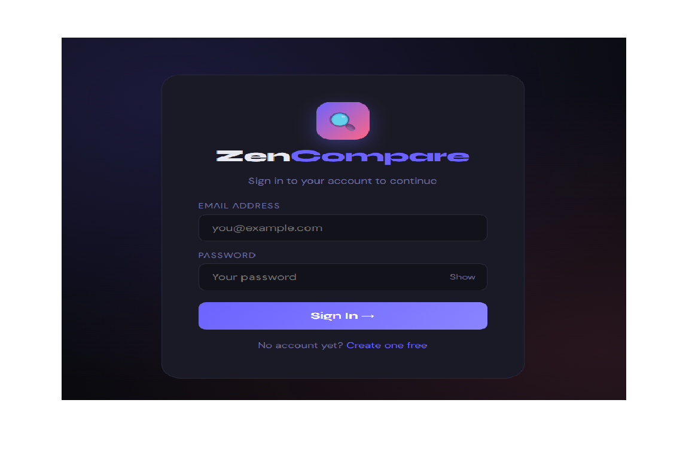
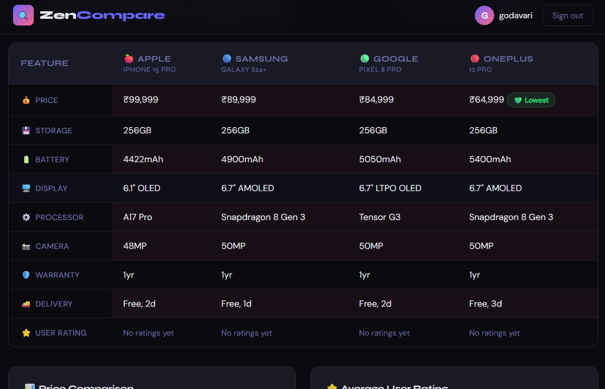

# zencompare
 Hackathon project - product comparison website
# ZenCompare 🚀

🔗 **Live Demo:** https://devikanaik29.github.io/zencompare1/
## 🔑 Login Instructions

Create your own account and log in to explore the website features.

(Note: This is a demo project, so any valid signup details can be used.)

## 📌 About the Project

ZenCompare is a hackathon project developed to compare products using AI-powered insights.
It focuses on providing a simple and user-friendly interface for decision-making.

## 💡 Features

* Product comparison
* Clean UI
* Fast results

## 🛠️ Built With

* AI tools (Claude)
* Web technologies

## 🤝 Contribution

This project was developed during a hackathon using AI tools and collaborative effort.

## 📷 Screenshots

## 👩‍💻 Author

Godavari Kanavi
